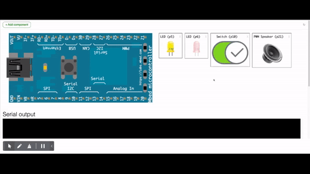

# SMART TRAFFIC LIGHT ADVERTISING

## Introduction 

This repository contains the hands-on labs for prototyping an IoT-based embedded system for controlling ads on traffic lights. Ads are to be displayed by considering the category of who is waiting at a given moment, meaning either the pedestrian/cyclist or car driver. 

It is based on the ARM MBED framework and is targeted to be either simulated online at https://simulator.mbed.com/ or run on embedded platforms supporting MBED. 

## Project Description

### Use case

For simplicity, let’s consider a traffic light with 2 colors: 
- YELLOW (Cars are moving, pedestrians/cyclists are waiting) and 
- RED (Cars are waiting, pedestrians/cyclists are crossing).

The following is the required operation scenario

- YELLOW ON: A pedestrian or cyclist arrives on a street crossing at the moment when the traffic light is “YELLOW” (Cars are moving). The traffic light billboard is simply showing let's say the time of day. 

- YELLOW BLINKING: The pedestrian/cyclist pushes on a button to indicate that he/she want to cross. From that moment on, the traffic light starts to blink during 30 seconds and a blinking sound is played as well. During that period, the billboard is going to show an advertisement specific for pedestrian/cyclist.

- RED ON: After 30 seconds, the traffic light turns RED and the sound plays continuously, then cars stop and wait for the light to turn back to YELLOW. Wen The pedestrians/cyclists are allowed to cross for about 1 min. During that time, the billboard is going to show an advertisement specific for car drivers. 

### Towards a data-driven revenue model

The smart embedded system to be prototyped, which will be controlling the billboard,  will report to a cloud service event-based status information about which ads is being displayed. 

The status information content to be sent will have the following format: 
- Device ID: to know which street traffic light is concerned 
- Timestamp: to indicate the time of the reported event
- Status -> to know what is displayed on the billboard
  - value = 0 -> Nothing displayed (YELLOW ON)
  - value = 1 -> Pedestrian/Cyclist ads (YELLOW BLINKING)
  - value = 2 -> Car driver ads (RED ON)

From collected data, every advertiser (so the customer paying for its ads to be advertised on the smart billboard) will get a personalised analytic report about its ads display.

### Architecture Design

### Embedded Algorithm Specifications

The following is the narrative of the embedded algorithm to be implemented:

- STATE0 => When starting the embedded application
    - A message with status value = 0 is sent to the remote IoT platform together with deviceID and timestamp.
    - YELLOW light is ON and RED light is OFF
    - Billboard (LCD) alternatively displays the company name for 3 seconds and then the current time for another 3 seconds and so on

- STATE1 => When a pedestrian pushes on a button to indicate that he/she want to cross, the following happens: 
    - A message with status value = 1 is sent to the remote IoT platform together with deviceID and timestamp. 
    - YELLOW light start BLINKING for 5 seconds before switching OFF. While YELLOW BLINKING, a blinking sound is played while RED light is still OFF.
    - Billboard (LCD) displays an ad for pedestrians (BUY 2 COFFEES FOR THE PRICE OF 1 AT GREEN COFFEE) 

- STATE2 => After 5 seconds, the pedestrian is allowed to cross, 
    - A message with status value = 2 is sent to the remote IoT platform together with deviceID and timestamp. .
    - YELLOW light turns OFF. RED light turns ON to stop the cars for a period of 10 seconds. During that period, a sound is played continuously to inform disabled people that they can cross
    - Billboard (LCD) displays an ad for car drivers (10% DISCOUNT ON YOUR FULL TANK AT SP RWANDA )

- After 10 seconds, go back into STATE0 the cars are allowed to move again.

## Hands-on labs

This prototyping project is organised into 3 hands-on labs in order to get progressivelyy familiar with different MBED APIs and also to develop the different features in an agile way. 

The following are the MBED API focus for each lab:
- LAB 1: Digital I/O + PwmOut
- LAB 2: Interrupts + Timeout 
- LAB 3: LCD + LoRaWAN

### Lab 1 - DEMO

Click on image to watch the demo

### Lab 2 - DEMO

Click on image to watch the demo

### Lab 3 - DEMO

Click on image to watch the demo

## Documentation References

- MBED API documentation https://os.mbed.com/docs/mbed-os/v5.15/introduction/index.html
- MBED Handbook https://os.mbed.com/handbook/Homepage
- MBED Cookbook https://os.mbed.com/cookbook/Homepage 

## Tools

- MBED simulator https://simulator.mbed.com/
